# HW 2: 3D Stylization

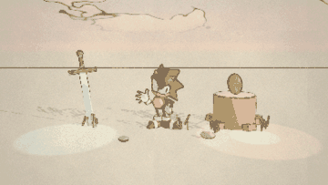

[Full turnaround video](images/turnaround.mp4)

Open `Assets/Scenes/Stylized Scene.unity` and press Play. The camera rotates around the scene, and the day and night cycle runs automatically.

- **Space:** advance to night during the day, or to morning at night.
- **P:** pause or resume the automatic day and night cycle.

## 1. Reference and Scene

| 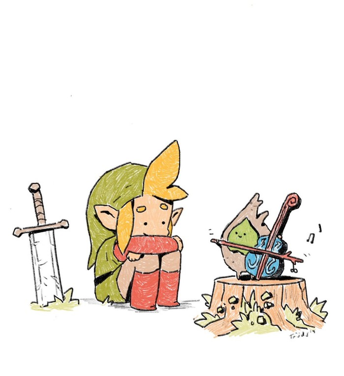 | 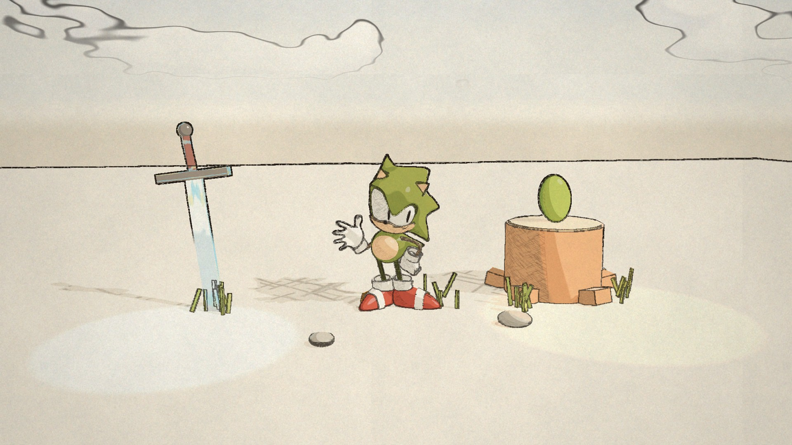 |
|:--:|:--:|
| *Concept art by [trudicastle](https://twitter.com/trudicastle/status/1122648793009098752)* | *Scene in Unity* |

I chose this reference because it has clear outlines, flat colors and visible pencil strokes in the shadows. The scene uses three tone shading, textured shadows and uneven outlines to follow this style. The colors of the stump, grass and boots are based on the reference.

The sword, stump, leaf character, grass and rocks are made from Unity primitives. The main character uses the Sonic model from the stylization lab, with green clothing and red boots to match Link's colors. The sword parts are combined into `Assets/Models/Sword.asset` so that the vertex animation moves them together.

| Day | Sunset | Night |
|:--:|:--:|:--:|
|  | 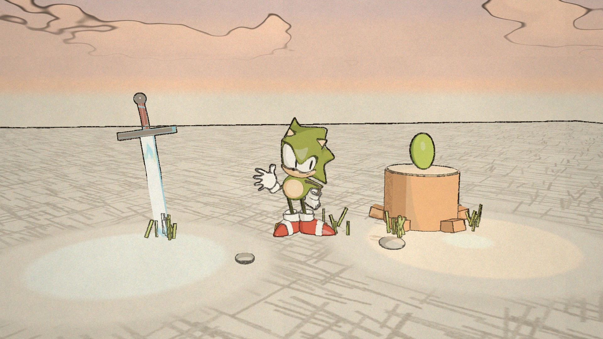 | 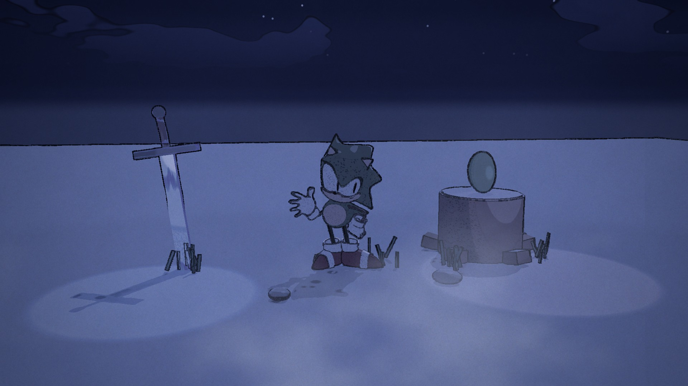 |

## 2. Surface Shader

`Toon Surface.shadergraph` uses the `ToonSurface` custom function in `Assets/Shaders/Includes/ToonSurface.hlsl`. It extends the three tone shader from the lab. Two thresholds divide the diffuse lighting into highlight, midtone and shadow regions. The smoothness parameter controls the transitions between them.

The shader supports the main light and additional lights. It calculates each additional light's diffuse contribution using the surface normal, light direction, distance attenuation and shadow attenuation. These contributions affect the tone selection. The light colors are also added to the surface color.

The scene contains one directional light with soft shadows, a warm point light near the stump and a cool point light near the sword.

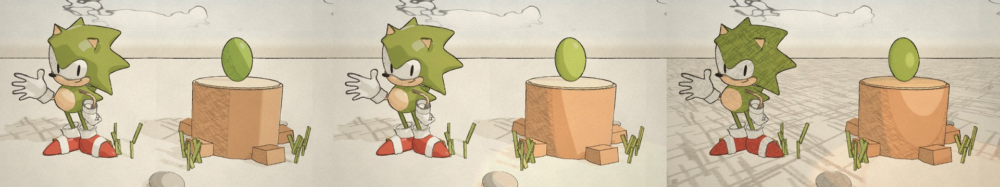

*Left: directional light only. Middle: directional light and two point lights. Right: point lights only.*

The rim highlight uses a Fresnel term and is limited to the side facing the main light. The specular highlight uses the Blinn-Phong model. Both use narrow `smoothstep` transitions to create clear boundaries. Their colors and strengths can be adjusted in the material.

The shadow texture was created with a Python script using PIL. It contains short strokes in two directions and a small amount of paper grain. The strokes wrap across the texture borders so the texture can repeat. The shader samples it using object UVs multiplied by `Shadow Scale`, then mixes the midtone and shadow colors in the shadow region. Cast shadows use the same pattern. Using object UVs keeps the pattern attached to the surface.

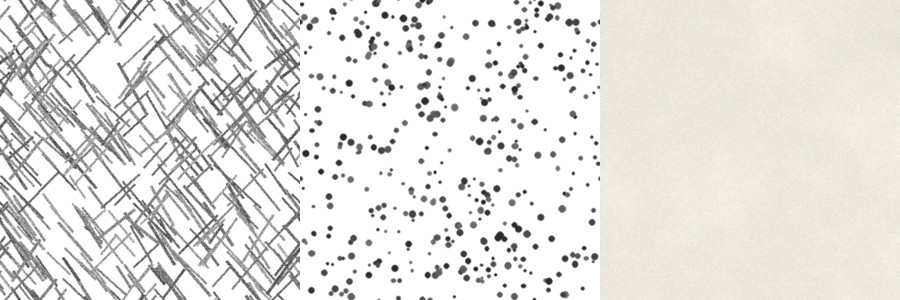

*Left: day shadow texture. Middle: night shadow texture. Right: paper texture.*

## 3. Special Shader for the Sword

`Hero Surface.shadergraph` uses the same surface lighting and adds `HeroGlow` and `HeroVertex` from `ToonSurface.hlsl`.

`HeroGlow` changes between two colors using a sine function and fbm noise. A Fresnel term places the glow near the edges, and a repeating UV pattern creates a bright stripe that moves along the blade. `HeroVertex` moves the sword up and down and rotates it slightly from side to side. Both effects use time rounded to fixed intervals. The blade material uses 8 updates per second to give the animation a drawn appearance.

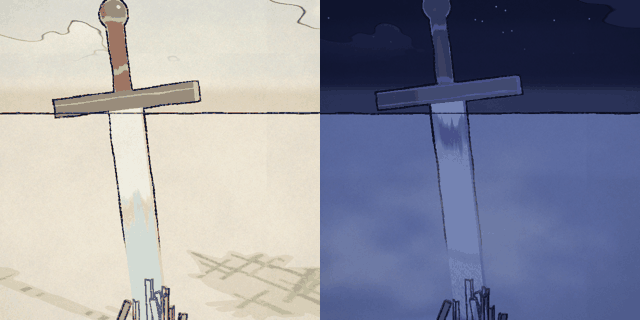

*Left: day material. Right: night material with purple and teal glow.*

The sword is placed on layer 3 and excluded from the Normal Feature. The normal pass uses an override material that does not include the sword's vertex animation. Including it would produce normal edges at the original position, which would not match the moving sword. Depth edges still provide its outline.

## 4. Outlines

The Full Screen Feature copies the camera image to a temporary buffer and applies the material. I added the second blit to copy the result back to the camera color buffer:

```csharp
Blit(cmd, colorBuffer, temporaryBuffer, settings.material);
Blit(cmd, temporaryBuffer, colorBuffer);
```

Depth texture is enabled in the URP asset. The Normal Feature uses `Materials/Post/Normal Copy.mat` to write view space normals to `Buffers/Normal Buffer`. The buffer resolution is 1920 x 1080.

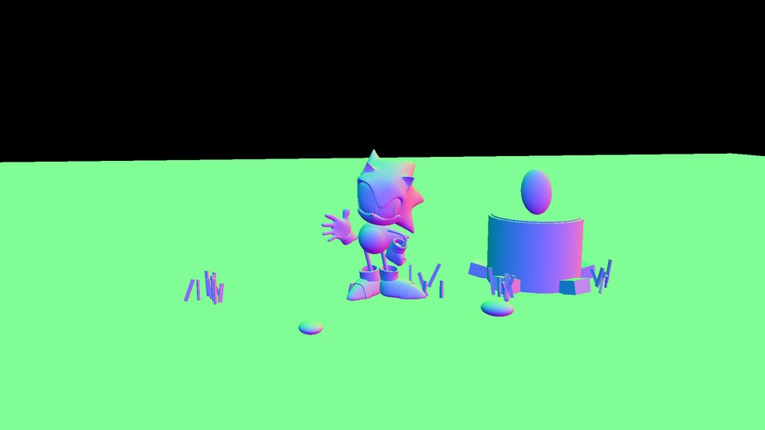

`Crayon Outline.shadergraph` uses `Includes/CrayonOutline.hlsl`. It applies the Roberts cross operator to linear eye depth and a 3x3 Sobel filter to the normal buffer. The depth difference is divided by the minimum sampled depth to reduce its dependence on distance.

On the ground near the horizon, neighboring pixels can have large depth differences even when there is no object boundary. The shader uses the normal buffer to raise the depth threshold for surfaces viewed at a shallow angle. This reduces unwanted lines in that area.

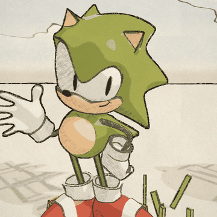

Value noise changes the depth sample positions and line thickness 6 times per second. A separate noise pattern creates small gaps in the lines. Together, these produce an uneven crayon effect. The normal edges use fixed sample positions to keep the internal details clear. Line thickness, edge thresholds, noise settings and line color can be adjusted in the material.

## 5. Full Screen Post Process

`Paper Post.shadergraph` runs after the outline pass and uses `Includes/PaperPost.hlsl`.

During the day, it slightly lowers saturation and shifts the colors toward warmer tones. It multiplies the image by a repeating paper texture and darkens the edges with a vignette. The paper texture was also made with the Python script, using soft patches and short lines to represent paper fibers.

At night, the shader applies a blue tint and reduces saturation further. Animated fbm noise creates a fog effect near the bottom of the screen. The global value `_NightBlend` controls the transition between the day and night effects.

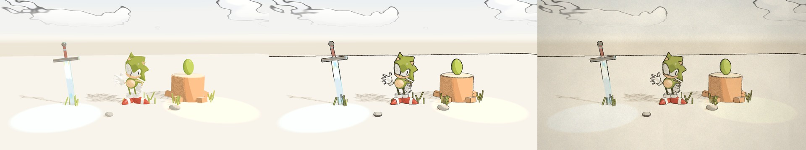

*Left: surface shading only. Middle: with outlines. Right: with the paper post process.*

## 6. Interactivity

`MaterialSwap.cs` stores one material set for each style. Each set can contain several materials because the Sonic model and sword have multiple material slots. This extends the single material example in the assignment.

`StyleSwitcher.cs` responds to Space. When the day and night cycle is assigned, it advances the cycle toward night or morning. The cycle switches material sets when the night value crosses 0.5. If no cycle is assigned, the script switches materials directly and blends the lights, camera background and post process over 0.6 seconds.

The night materials use cooler colors, a dot texture in the shadows and stronger rim highlights. The sword glow changes to purple and teal. The two point lights also become brighter at night.

## 7. Extra Credit: Skybox and Day and Night Cycle

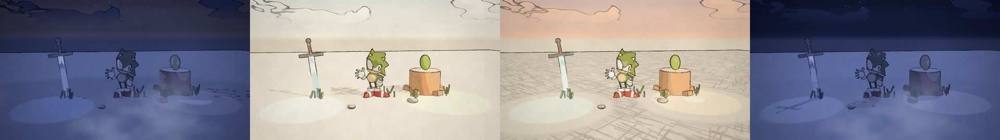

*From left to right: dawn, day, sunset and night.*

`Sketch Sky.shader` is an HLSL skybox shader that uses the functions in `Noise.hlsl`. The sky color changes from the horizon to the top of the sky in several soft bands. Separate day, sunset and night colors are blended during the cycle.

The sun and moon are disks with uneven edges and dark outlines. A second disk, shifted to one side, creates the darker part of the moon. The clouds use fbm noise, two color tones and a thin outline. They move slowly across the sky. At night, stars appear and change brightness in steps. Below the horizon, the sky uses the ground color to make the edge of the ground plane less visible.

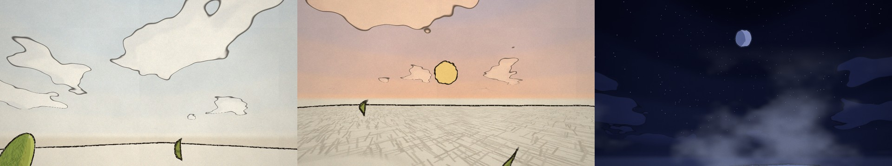

`DayNightCycle.cs` controls the time of day, with one full cycle lasting 40 seconds in the scene. A sine function controls the sun's elevation, and its horizontal angle changes over time. The directional light represents the sun during the day and the moon at night. Its direction, color and intensity change with the cycle.

The script also adjusts the point lights and selects the material set. It sends `_SunDir`, `_MoonDir`, `_Sunset` and `_NightBlend` to the shaders. Near sunset, the low light angle produces longer cast shadows and places more of the ground in the textured shadow region.

## 8. Render Feature Order

| Feature | Event | Material |
|---|---|---|
| Normal Feature | After Rendering Opaques | Normal Copy |
| Crayon Outline | After Rendering Transparents | Crayon Outline |
| Paper Post | Before Rendering Post Processing | Paper Post |

## Credits

- Concept art: [trudicastle](https://twitter.com/trudicastle/status/1122648793009098752)
- Sonic model: course stylization lab

---

<details>
<summary>Original assignment instructions</summary>

# HW 2: *3D Stylization*

## Project Overview:
In this assignment, you will use a 2D concept art piece as inspiration to create a 3D Stylized scene in Unity. This will give you the opportunity to explore stylized graphics techniques alongside non-photo-realistic (NPR) real-time rendering workflows in Unity.

|   |  |
|:--:|:--:|
| *2D Concept Illustration* | *3D Stylized Scene in Unity* |
### HW Task List:
1. Picking a Piece of Concept Art
2. Interesting Shaders
3. Outlines
4. Full Screen Post Process Effect
5. Creating a Scene
6. Interactivity
7. Extra Credit

---
# Tasks

## 0. Base Project Overview

After forking the repo, take a moment to watch this brief HW/Base Project Overview which goes over things that you're expected to bring over from the lab, and etc.
- [See the Project Overview here](https://youtu.be/JmVTmpgSz5U)

## 1. Picking a Piece of Concept Art

Choose a simple illustration to guide your stylization. Choose a relatively simple piece of art THAT INCLUDES OUTLINES. You *might* want to look through the rest of the homework instructions before committing to one. Here are some examples of styles that will work well. Feel free to choose one of these, but we encourage your to pick your own.

|  |  |  |  |   | 
|:--:|:--:|:--:|:--:|:--:|
| *https://twitter.com/stefscribbles/status/1646235145110683650* | *https://twitter.com/trudicastle/status/1122648793009098752* | *https://twitter.com/caomor/status/1049494055518908416* | *https://www.artstation.com/requinoesis* | *https://twitter.com/cysketch/status/1712442821389713597* | 


**Disclaimer: Don't forget to identify and credit the artist who created the concept art : )**

**[Emma Koch](https://www.artstation.com/ekoch)**, an amazing 3D artist I happened to stumble upon on ArtStation produces incredible 2D-esque 3D art pieces. Some of the references I picked above were inspired directly from her work. I'd definitely check out her artstation for any inspiraiton if you want some! [Link](https://www.artstation.com/ekoch)

---
## 2. Interesting Shaders

Let's create some custom surface shaders for the objects in your scene, inspired by your concept art! 

Take a moment to think about the main characteristics that you see in the shading of your concept art. What makes it look appealing/aesthetic?
  * Is it the color palette? How are the different colors blending into each other? Is there any particular texture or pattern you notice?
  * Are there additional effects such as rim or specular highlights?
  * Are there multiple lights in the scene?

These are all things we want you to think about before diving into your shaders!

### To-Do:
1. **Improved Surface Shader**
   - Create a surface shader inspired by the surface(s) in your concept art. Use the three tone toon shader you created from the Stylization Lab as a starting point to build a more interesting shader that fulfills all of the following requirements:
      1. **Multiple Light Support**
          - Follow the following tutorial to implement multiple light support.
              - 
              - [Link to Complete Additional Light Support Tutorial Video](https://youtu.be/1CJ-ZDSFsMM)
      2. **Additional Lighting Feature**
          - Implement a Specular Highlight, Rim Highlight or another similarly interesting lighting-related effect
      3. **Interesting Shadow**
          1. Create your own custom shadow texture!
              - You can use whatever tools you have available! Digital art (Photoshop, CSP, Procreate, etc.), traditional art (drawing on paper, and then taking a photo/scan)-you have complete freedom!
          2. Make your texture seamless/tesselatable! You can do this through the following online tool: https://www.imgonline.com.ua/eng/make-seamless-texture.php
          3. Modify your shadows using this custom texture in a similar way to Puzzle 3 from the Lab
          4. Now, instead of using screen position, use the default object UVs!
              - In the 3rd Puzzle of the Lab, the shadow texture was sampled using the Screen Position node. This time, let's use the object's UV coordinates to have the shadows conform to geometry. Hint: To get a consistent looking shadow texture scale across multiple objects, you're going to want some exposed float parameter, "Shadow Scale," that will adjust the tiling of the shadow texture. This will allow for per material control over the tiling of your shadow texture.
              - 
              - Notice how in this artwork by [Emma Koch](https://www.artstation.com/ekoch), Link's shadow does not remain fixed in screen space as it is drawn via object UV coordinates.

      4. **Accurate Color Palette**
          - Do your best to replicate the colors/lighting of your concept art!
3. **Special Surface Shader**
   - *Let's get creative!* Create a SPECIAL second shader that adds a glow, a highlight or some other special effect that makes the object stand out in some way. This is intended to give you practice riffing on existing shaders. Most games or applications require some kind of highlighting: this could be an effect in a game that draw player focus, or a highlight on hover like you see in a tool. If your concept art doesn't provide a visual example of what highlighting could look like, use your imagination or find another piece of concept art. Duplicate your shader to create a variant with an additional special feature that will make the hero object of your scene stand out. Choose one of the following three options:
       - **Option 1: Animated colors**
              -   

          - The above is a simple example of what an animated surface shader might do, eg flash through a bunch of different colors. Using at least two toolbox functions, animate some aspect of the surface shader to create an eye-catching effect. Consider how procedural patterns, the screen space position and noise might contribute.
          - Useful tips to get started:
              - Use the Time node in Unity's shader graph to get access to time for animation. Consider using a Floor node on time to explore staggered/stepped interpolation! This can be really helpful for selling the illusion of the animation feeling handdrawn.
       - **Option 2: Vertex animation**
          - Similar to the noise cloud assignment, modify your object shader to animate the vertex positions of your object, eg. making an object sway or bob up and down to make it stand out. You should be able to figure out how to do this given the walkthrough so far, but if you need addition help, check out [this tutorial](https://www.youtube.com/watch?v=VQxubpLxEqU&ab_channel=GabrielAguiarProd).
       - **Option 3: Another Custom Effect Tailored to your Concept Art**
          - If you'd like to do an alternative effect to Option 1, just make sure that your idea is roughly similar in scope/difficulty. Feel free to make an EdStem post or ask any TA to double check whether your effect would be sufficient.

---
## 3. Outlines
Make your objects pop by adding outlines to your scene! 

Specifically, we'll be creating ***Post Process Outlines*** based on Depth and Normal buffers of our scene!

### To-Do:
1. Render Features! Render Features are awesome, they let us add customizable render passes to any part of the render pipeline. To learn more about them, first, watch the following video which introduces an example usecase of a renderer feature in Unity:
    - [See here](https://youtu.be/GAh225QNpm0?si=XvKqVsvv9Gy1ufi3)
2. Next, let's explore the HW base code briely, and specifically, learn more about the "Full Screen Feature" that's included as part of your base project. There's a small part missing from "Full Screen Feature.cs" that's preventing it from applying any type of full screen shader to the screen. Your job is to solve this bug and in the process, learn how to create a Full Screen Shadergraph, and then have it actually affect the game view! Watch the following video to get a deeper break down of the Render Feature's code and some hints on what the solution may be.
    - [See here for Full Screen Render Feature Debugging Hints/Overview Video](https://youtu.be/Bc9eTlMPdjU)
4. Using what we've learnt about Render Features/URP as a base, let's now get access to the Depth and Normal Buffers of our scene!
    - Unity's Universal Render Pipeline actually already provides us with the option to have a depth buffer, and so obtaining a depth buffer is a very simple/trivial process.
    - This is not the case for a Normal Buffer, and thus, we need a render feature to render out the scene's normals into a render texture. Since the render feature for this has too much syntax specific fluff that's too Unity heavy and not very fun, I've provided a working render feature that renders objects' normals into a render texture in the /Render Features folder, called the "Normal Feature." There is also a shader provided, "Hidden/Normal Copy" or "Normal Copy.shader."
        - Your task is to add the Normal Feature to the render pipeline, make a material off of the Normal Copy shader and then plug it into the Normal Feature, and finally, connect the render texture called "Normal Buffer" located in the "/Buffers" directory as the destination target for the render feature.
            - Set the resolution of the Normal Buffer render texture to be equal to your game window resolution.
    - Watch the following video for clarifications on both of these processes, and also, how to actually access and read the depth and normal buffers once we've created them.
        - [See here for complete tutorial video on Depth and Normal Buffers](https://youtu.be/giLPZA-xAXk)

5. Finally, using everything you've learnt about Render Features alongside the fact that we now have proper access to both Depth and Normal Buffers, let's create a Post Process Outline Shader!
    - We **STRONGLY RECOMMEND** watching at least one of these Incredibly Useful Tutorials before getting started on Outlines:
        - [NedMakesGames](https://www.youtube.com/@NedMakesGames)
            - [Tutorial on Depth Buffer Sobel Edge Detection Outlines in Unity URP](https://youtu.be/RMt6DcaMxcE?si=WI7H5zyECoaqBsqF)
        - [Robin Seibold](https://www.youtube.com/@RobinSeibold)
            -  [Tutorial on Depth and Normal Buffer Robert's Cross Outliens in Unity](https://youtu.be/LMqio9NsqmM?si=zmtWxtdb1ViG2tFs)
        - [Alexander Ameye](https://ameye.dev/about/)
            - [Article on Edge Detection Post Process Outlines in Unity](https://ameye.dev/notes/edge-detection-outlines/)
        - **Important Clarification/Note on the Tutorials:**
            - You will quickly notice after watching/reading any of these tutorials that many of them use a Render Feature to render out a single DepthNormals Texture that encodes both depth and normal information into a single texture. This optimization saves on performance but results in less accurate depth or normals information and is overall more confusing for a first time experience into Render Features. Thus, for this assignment, we will just be sticking to our approach of having separate Depth and Normal buffers.
   
    - Next, we will create a basic Depth and Normal based outline prototype that produces black outlines at areas of large depth and normal difference across the screen.
            - Explore different kinds of edge detection methods, including Sobel and Robert's Cross filters
            - Make sure the outline has adjustable parameters, such as width. 
    - Let's get creative! Modify your outline to be ANIMATED and to have an appearance that resembles the outlines in your concept art / OR, if the outlines in your concept art are too plain, try to make your outline resemble crayon/pencil sketching/etc.
        - Use your knowledge of toolbox functions to add some wobble, or warping or noise onto the lines that changes over time.
        - In my example below, you might be able to notice that the internal Normal Buffer based edges actually don't have any warping/animation. I did this intentionally because I wanted the final look to still have some kind of structure. Thus, by doing the depth and normal outlines in separate passes, I'm able to have a variety of animated/non-animated outlines composited together : ) !
            <p align="center"> 

7. (OPTIONAL) If you're not satisfied with the look of your outlines and are looking for an extra challenge, after implementing depth/normal based post processing, you may explore non-post process techniques such as inverse hull edge rendering for outer edges to render bolder, more solid looking outlines for a different look.
    - Check out Alexander Ameye's article on alternative methods of outline rendering in Unity: [See Here](https://ameye.dev/notes/rendering-outlines/)

---
## 4. Full Screen Post Process Effect
We're nearing the end! 

### To-Do:
Ok, now regardless of what your concept art looks like, using what you know about toolbox functions and screen space effects, add an appealing post-process effect to give your scene a unique look. Your post processing effect should do at least one of the following.
* A vingette that darkens the edges of your images with a color or pattern
* Color / tone mapping that changes the colorization of your renders. [Here's some basic ideas, but please experiment](https://gmshaders.com/tutorials/basic_colors/) 
* A texture to make your image look like it's drawn on paper or some other surface.
* A blur to make your image look smudged.
* Fog or clouds that drift over your scene
* Whatever else you can think of that complements your scene!

***Note: This should be easily accomplishable using what you should have already learnt about working with Unity's Custom Render Features from the Outline section!***

---
## 5. Create a Scene
Using Unity's controls, create a ***SUPER BASIC*** scene with a few elements to show off your unique rendering stylization. Be sure to apply the materials you've created. Please don't go crazy with the geometry -- then you'll have github problems if your files are too large. [See here](https://docs.github.com/en/repositories/working-with-files/managing-large-files/about-large-files-on-github). 

Note that your modelling will NOT be graded at all for this assignment. It is **NOT** expected that your scene will be a one-to-one faithful replica of your concept art. You are **STRONGLY ENCOURAGED** to find free assets online, even if they don't strongly resemble the geometry/objects present in your concept art. (TLDR; If you choose to model your own geometry for this project, be aware of the time-constraint and risk!)

Some example resources for finding 3D assets to populate your scene With:
1. [SketchFab](https://sketchfab.com/)
2. [Mixamo](https://www.mixamo.com/#/)
3. [TurboSquid](https://www.turbosquid.com/)

## 6. Interactivity
As a finishing touch, let's show off the fact that our scene is rendered in real-time! Please add an element of interactivity to your scene. Change some major visual aspect of your scene on a keypress. The triggered change could be
* Party mode (things speed up, different colorization)
* Memory mode (different post-processing effects to color you scene differently)
* Fanart mode (different surface shaders, as if done by a different artist)
* Whatever else you can think of! Combine these ideas, or come up with something new. Just note, your interactive change should be at least as complex as implementing a new type of post processing effect or surface shader. We'll be disappointed if its just a parameter change. There should be significant visual change.

### To-Do:
* Create at least one new material to be swapped in using a key press
* Create and attach a new C# script that listens for a key press and swaps out the material on that key press. 
Your C# script should look something like this:
```
public Material[] materials;
private MeshRenderer meshRenderer;
int index;

void Start () {
          meshRenderer = GetComponent<MeshRenderer>();
}

void Update () {
          if (Input.GetKeyDown(KeyCode.Space)){
                 index = (index + 1) % materials.Count;
                 SwapToNextMaterial(index);
          }
}

void SwapToNextMaterial (int index) {
          meshRenderer.material = materials[index % materials.Count];
}
```
* Attach the c# script as a component to the object(s) that you want to change on keypress
* Assign all the relevant materials to the Materials list field so you object knows what to swap between.
 
---
## 7. Extra Credit
Explore! What else can you do to polish your scene?
  
- Implement Texture Support for your Toon Surface Shader with Appealing Procedural Coloring.
    - I.e. The procedural coloring needs to be more than just multiplying by 0.6 or 1.5 to decrease/increase the value. Consider more deeply the relationship between things such as value and saturation in artist-crafted color palettes? 
- Add an interesting terrain with grass and/or other interesting features
- Implement a Custom Skybox alongside a day-night cycle lighting script that changes the main directional light's colors and direction over time.
- Add water puddles with screenspace reflections!
- Any other similar level of extra spice to your scene : ) (Evaluated on a case-by-case basis by TAs/Rachel/Adam)

## Submission
1. Video of a turnaround of your scene
2. A comprehensive readme doc that outlines all of the different components you accomplished throughout the homework. 
3. All your source files, submitted as a PR against this repository.

## Resources:

1. Link to all my videos:
    - [Playlist link](https://www.youtube.com/playlist?list=PLEScZZttnDck7Mm_mnlHmLMfR3Q83xIGp)
2. [Lab Video](https://youtu.be/jc5MLgzJong?si=JycYxROACJk8KpM4)
3. Very Helpful Creators/Videos from the internet
    - [Cyanilux](https://www.cyanilux.com/)
        - [Article on Depth in Unity | How depth buffers work!](https://www.cyanilux.com/tutorials/depth/) 
    - [NedMakesGames](https://www.youtube.com/@NedMakesGames)
        - [Toon Shader Lighting Tutorial](https://www.youtube.com/watch?v=GQyCPaThQnA&ab_channel=NedMakesGames)
        - [Tutorial on Depth Buffer Sobel Edge Detection Outlines in Unity URP](https://youtu.be/RMt6DcaMxcE?si=WI7H5zyECoaqBsqF)
    - [MinionsArt](https://www.youtube.com/@MinionsArt)
        - [Toon Shader Tutorial](https://www.youtube.com/watch?v=FIP6I1x6lMA&ab_channel=MinionsArt)
    - [Brackeys](https://www.youtube.com/@Brackeys)
        - [Intro to Unity Shader Graph](https://www.youtube.com/watch?v=Ar9eIn4z6XE&ab_channel=Brackeys)
    - [Robin Seibold](https://www.youtube.com/@RobinSeibold)
        - [Tutorial on Depth and Normal Buffer Robert's Cross Outliens in Unity](https://youtu.be/LMqio9NsqmM?si=zmtWxtdb1ViG2tFs)
    - [Alexander Ameye](https://ameye.dev/about/)
        - [Article on Edge Detection Post Process Outlines in Unity](https://ameye.dev/notes/edge-detection-outlines/)

</details>
